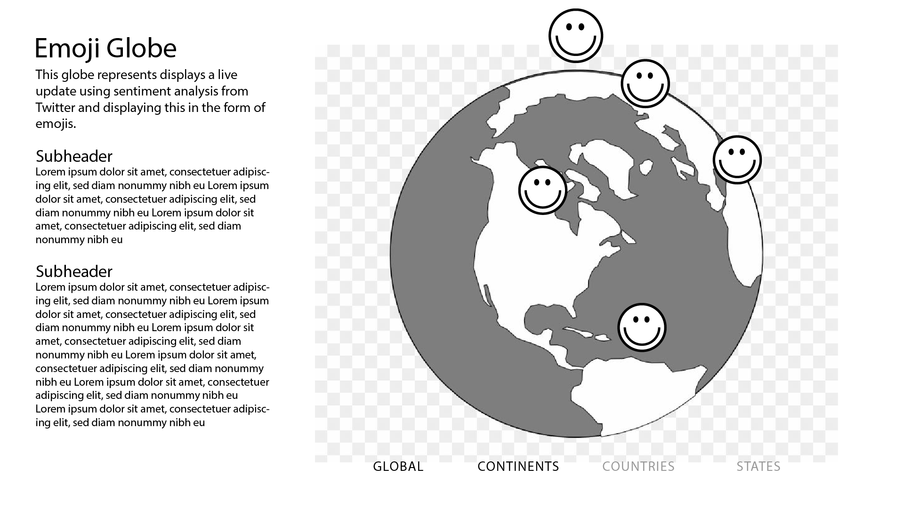
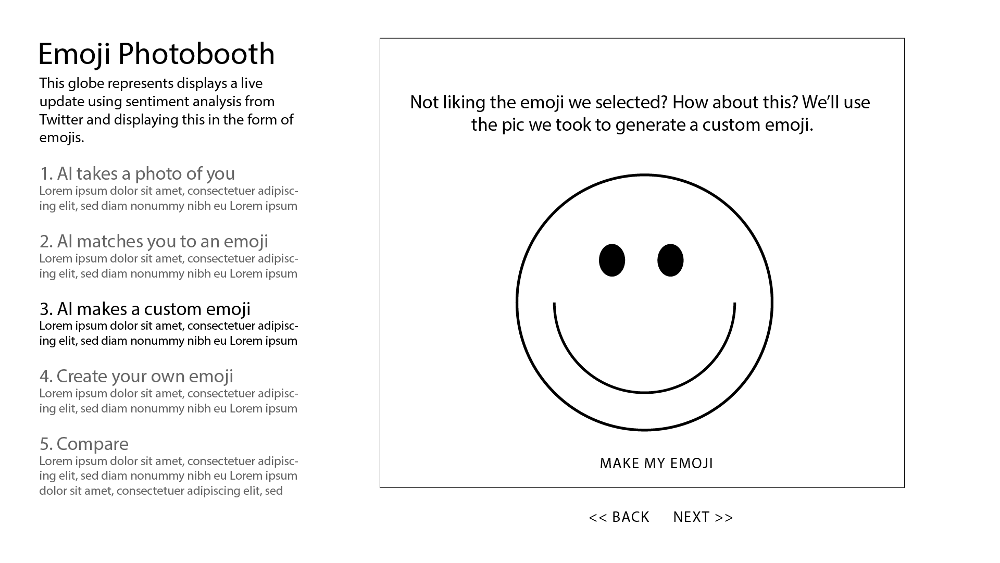
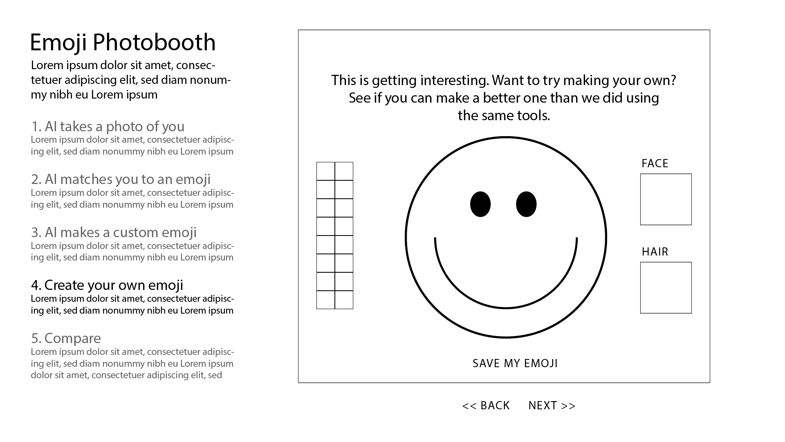

# Exercise 2: Form

## Revised wireframes as a response to the pandemic and guest feedback

## Prototyping
### Emoji Clock
Additional features: the ability to see look back at previous dates. Need to indicate states for days and dates that are in the future. Does this reflect actual emoji use or sentiment analysis interpreted as emojis? Live updates? How to visualize the long arc, patterns across time?
EmojiClock02.jpg

### Emoji Map
Updates in realtime. The can layer the various filters. This may need to come with a seizure warning. Visualization actual emoji use or sentinent analysis converted to emoji? A rotatable 3D globe or possibly Mapbox. 

### Emoji Photobooth
Missing: a clear visualization of which version of the emoji users prefereed. Also, possibly user generated emoji or bitmoji? Both? There's some uncanny valley at work here. 

## Audience

**Who is your audience (persona, demographic or processional group, knowledgeable about context)?**

While the audience for this project is broad and includes anyone who is familiar with emojis and curious about their origin. As I’m conducting this research project alongside work I’m doing with the Smithsonian National Museum of Natural History I’ll be adopting their target audience, millennials, for an exhibition about cellphones. I anticipate this target audience will influence visual representation, tone and possibly the content.

That said, the museum has roughly 7 million visitors per year and their backgrounds vary considerably. Most, but not all, are English speakers. Universal design principles will need to be followed to maximize reach and usability.

**How is your audience reading or encounter your project (media, UI, distribution channel, types of devices, spatial context)?**

The audience will likely encounter my project as a browser-based experience but there’s a chance this could be featured in an exhibition, in which case it will likely be running locally and presented on a touchscreen monitor in a section of the exhibit about cultural uses and language. 

**What does your project ask of your audience to do (input, involvement, user experience)?**

Given the environment in which this project might be displayed I can’t assume a user will spend more than a couple minutes with the experience. My goal is to create a short, fast, experience that generates surprise, quickly conveys context and provides multiple vectors into the emoji story. 

The experience will likely be browser-based and touchscreen compatible.The project assumes prior knowledge and experience with emojis. 

**What does your audience learn and take away from their user experience?**

I’d like the audience/users to walk away with clarity about the history of emojis. Where they came from, how they evolved visually, how their meaning has changed, and what agencies/platforms have a stake in shaping that conversation.

# Concept: A Visual Guide to Emojis

I’m researching the evolving visual language of emoji from their origin in Japan in 1999 as tool for clearly and succinctly conveying information to a method for conveying subtext and ultimately to a semiotic language with it’s own character, meaning and function. I’m interested in surfacing the unseen dialog and history of emojis; where they came from, how both their representation and meaning have changed. How have the uses and meanings of emoji evolved over time? How did the original set of emoji, which avoided the presentations of people, become a flashpoint of diversity debate? 

## Research

1. History
    1. [https://www.wired.com/story/guide-emoji/](https://www.wired.com/story/guide-emoji/)
    2. [https://www.japantimes.co.jp/life/2016/09/17/digital/emoji-evolution-emoticons/](https://www.japantimes.co.jp/life/2016/09/17/digital/emoji-evolution-emoticons/)
    3. [https://blog.emojipedia.org/apples-emoji-evolution-1997-2018/](https://blog.emojipedia.org/apples-emoji-evolution-1997-2018/)
2. Unicode Consortium
    4. [https://unicode.org/emoji/charts/full-emoji-list.html](https://unicode.org/emoji/charts/full-emoji-list.html)
    5. [https://home.unicode.org/emoji/](https://home.unicode.org/emoji/)
3. Categories of emoji
    6. [Smileys & People](https://emojipedia.org/people/)
    7. [Animals & Nature](https://emojipedia.org/nature/)
    8. [Food & Drink](https://emojipedia.org/food-drink/)
    9. [Activity](https://emojipedia.org/activity/)
    10. [Travel & Places](https://emojipedia.org/travel-places/)
    11. [Objects](https://emojipedia.org/objects/)
    12. [Symbols](https://emojipedia.org/symbols/)
    13. [Flags](https://emojipedia.org/flags/)
4. Platforms
5. [Most frequent emoji](https://home.unicode.org/emoji/emoji-frequency/)
6. Personalities
    14. [Jennifer Daniel](https://www.itsnicethat.com/features/jennifer-daniel-whats-next-for-emojis-preview-of-the-year-2020-illustration-060120)
    15. [https://www.wnycstudios.org/podcasts/notetoself/articles/charles-bliss-emoji](https://www.wnycstudios.org/podcasts/notetoself/articles/charles-bliss-emoji)
7. Pop culture
    16. How to [read emojis](https://emojipedia.org/)
    17. Guess [movies](http://www.josiesjuice.net/2014/10/guess-movie-as-emojis-answers.html)
    18. [digital laugh](https://pudding.cool/2019/10/laugh/)
    19. [the "mediatized self"](https://www.tandfonline.com/doi/full/10.1080/1362704X.2016.1173349)

## Datasets

*   [https://data.world/kgarrett/emojis](https://data.world/kgarrett/emojis)
*   [https://data.world/eliasdabbas/full-emoji-database](https://data.world/eliasdabbas/full-emoji-database)
*   [https://www.kaggle.com/thomasseleck/emoji-sentiment-data](https://www.kaggle.com/thomasseleck/emoji-sentiment-data)
*   [https://www.kaggle.com/rtatman/emojinet](https://www.kaggle.com/rtatman/emojinet)
*   [https://github.com/iamcal/emoji-data](https://github.com/iamcal/emoji-data)
*   [https://milesj.gitbook.io/emojibase/data](https://milesj.gitbook.io/emojibase/data)

## Topics

*   Diversity
    *   Skin tone cataloging
    *   Roots in japan, expansion to be more diverse and reimporting back to japan
*   Growth/expansion
    *   How to track the overall quantify of emojis and uses across platforms?
*   Usage, most popular by platform/country
*   Process of getting an emoji approved by Unicode
*   Legalities of emoji display across platforms
*   Platforms
*   Language: presentation and evolution
*   Effect on identity over time
*   Texting and life events
    *   Relationships lost 
    *   Breakups
    *   Asking out for dates
    *   Marriage proposals

## Forms

Possibility create a filtering system.

*   Bubble chart
*   Zooms in/out?
*   Mouseover an emoji to see it closer. Other metadata?
*   Filters
    *   Platform
    *   Emoji category (add tags for people?)
    *   Year/version

## References

*   [https://www.bloomberg.com/graphics/2015-auto-sales/](https://www.bloomberg.com/graphics/2015-auto-sales/)
*   [http://jillhubley.com/project/nyclanguages/](http://jillhubley.com/project/nyclanguages/)
*   [https://web.northeastern.edu/naturalizing-immigration-dataviz/](https://web.northeastern.edu/naturalizing-immigration-dataviz/)

## Questions

*   Focus on one platform or compare multiple platforms
*   How to download/save/address images in a database
*   Scrollytelling?
*   How to view them all? Zoom in/out based on DV population?

## Partnerships

*   Smithsonian Natural Museum of Natural History
*   Unicode

## Interviews

*   Josh Bell

# Previous Concepts

## Data Inequality/Diversity

### Concept

I’m visualizing data inequality because I want to expose how corporate and political entities benefit from controlling access to data.

### Research

8. [https://www.japantimes.co.jp/life/2016/09/17/digital/emoji-evolution-emoticons/](https://www.japantimes.co.jp/life/2016/09/17/digital/emoji-evolution-emoticons/)
9. [https://unicode.org/emoji/charts/full-emoji-list.html](https://unicode.org/emoji/charts/full-emoji-list.html)
10. [https://home.unicode.org/emoji/](https://home.unicode.org/emoji/)
11. [Most frequent emoji](https://home.unicode.org/emoji/emoji-frequency/)
12. [https://emojipedia.org/file-folder/](https://emojipedia.org/file-folder/)
13. [https://blog.emojipedia.org/apples-emoji-evolution-1997-2018/](https://blog.emojipedia.org/apples-emoji-evolution-1997-2018/)
14. [Jennifer Daniel](https://www.itsnicethat.com/features/jennifer-daniel-whats-next-for-emojis-preview-of-the-year-2020-illustration-060120)

### References

*   [digital laugh](https://pudding.cool/2019/10/laugh/)
*   [the "mediatized self"](https://www.tandfonline.com/doi/full/10.1080/1362704X.2016.1173349)
*   - we read this in MS1/MS2 hybrid class last semester, not sure if the other section did too: (related to origin of cell phones/where the materials come from/mapping all components): [https://anatomyof.ai/](https://anatomyof.ai/)
*   [ (Links to an external site.)](https://anatomyof.ai/)

### Discussion

*   I would love a visualization about how people talk about their relationship with phones and internal/external identity, broken down by age. i don't know what those interviews look like in structure, but it would be cool if quotes are pulled with a similar beginning ("i define my identity as..." idk).
*   aside from being super insightful content-wise, i think it's a super interesting visualization exercise: how do you turn a database of interviews into a visual? a visualization capturing the chaos and confusion about this topic would be fascinating.
*   i was also intrigued by the cell phone tower and connectivity access idea: where are there connectivity deserts in the US? what demographic can you layer on top to provide more insight? it kind of reminds me of the viz we saw at the census exhibit. this feels like a more digestible visualization exercise with still a super impactful outcome.
*   a big +1 to the emojis idea. accessible database and while a seemingly trivial part of culture, it actually has HUGE impact on how we communicate on the daily as humans in the 21st century. love the evolution of emoji angle. at work, i have a tangentially related project coming out soon, and don't let me forget to send it to you. :)
*   The language idea with texting is especially interesting following your description  
*   Cell phones and how they influence communication: how different texting styles can influence relationships (I have lost a friend over me not texting her enough, even though I didn't text her less than I did anyone else...haha), the "politics" around how long it takes between "read receipts" and actually responding (and how that influences people's psychology), etc
*   A certain period without a cell phone: what sort of things are affected? (self-tracking)

### Goals

*   Help SI team to identify and understand stories
*   Designing for millennials
*   Accuracy
*   Scientifically driven

### Topics

*   Cellphones
*   Interviews about cellphone use
*   Language: presentation and evolution
*   Effect on identity over time
*   Earth/mineral Stories
*   Data inequality
*   Infrastructure
*   Expectations vs reality
*   Texting and life events
    *   Relationships lost 
    *   Breakups
    *   Asking out for dates
    *   Marriage proposals

### Partnerships

*   Smithsonian Natural Museum of Natural History
*   Unicode

### Forms

### Data 

### Interviews

*   Josh Bell

## 

---

## Performance

### Concept

I’m visualizing performative data because I want to create a visual system that transposes music/movement into a language that audiences can understand

### References

*   [http://www.flong.com/](http://www.flong.com/)
*   [http://www.flong.com/texts/lists/slit_scan/](http://www.flong.com/texts/lists/slit_scan/)
*   Rudolph Laban
*   Ballet Rotoscope by Euphrates: [https://euphrates.jp/ballet-rotoscope](https://euphrates.jp/ballet-rotoscope)
*   "Programmed: Rules, Codes, and Choreographies in Art, 1965–2018" exhibition at Whitney museum that prints a trace (location track on the stage) of a ballet in theater. 
*   Two references available from the NYU lib if you are interested:
    *   Müller Meinard. Information Retrieval for Music and Motion. San Bernardino, CA: Springer, 2010.
    *   Li, Tao, Mitsunori Ogihara, and George Tzanetakis. Music Data Mining. Boca Raton: CRC Press, 2012.
*   [The WIRED Guide to Emoji](https://www.wired.com/story/guide-emoji/)
    *   connect//show key dates 

### Research

### Discussion

*   adding a live, data-based visual element to a performance, that heightens the performance. So cool.

### Goals

*   A tool I can use in live performance
*   Qualitative AND Quantitative
*   Really interesting topic!! I guess you can either focus on one type of performance or compare a common representation in different forms.

### Topics

*   Decision tree of improvisation?
*   Where do ideas come from?
*   Using existing art to create more art
*   Artifacts are unique/personal to the artist being interpreted.
*   I would like to better understand my own processes
*   Giving structure to intuitive processes

### Partnerships

### Interviews

*   Fung Chern Hwei
*   Baba Israel
*   Jay Painter

### Forms

*   Music
*   Drama
*   Dance
*   Comedy

### Data

*   Bio
*   Body tracking
*   Slitscan
*   Sounds

### Interviews

