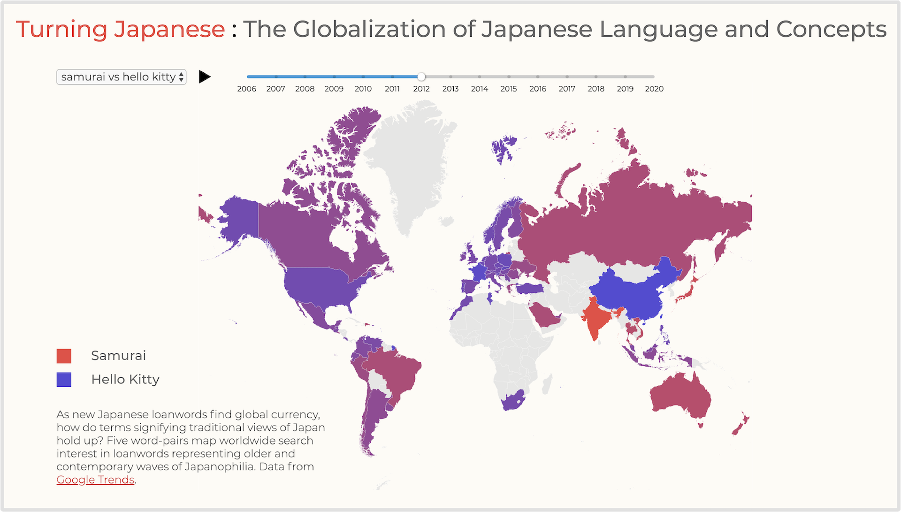

# Turning Japanese: The Globalization of Japanese Language and Concepts  
## Master of Science in Data Visualization, Parsons School of Design

## Abstract
In August 1945, Japan lay a smoldering ruin, its military defeated, and great cities bombed to oblivion. Yet within one generation, the nation was the world’s number two economy, and within two, a global soft power. This thesis investigates the process whereby Japan became a cultural giant, what it means for the world, for the West in particular, and also for Japan itself. For the world, Japan can provide signals on what the economic rise of other Asian nations portends in terms of their own soft power. At a time when Asia represents two-thirds of global economic growth and Asians are the United States’ fastest growing immigrant group, the stakes are high.  For Asians, opportunities arise for governments to leverage soft power, and for culture industries to increase their reach worldwide. For Westerners, opportunities come in the form of enriched experiences in every sector from food to film, accompanied by risks of misunderstanding as Western societies turn inward and Western culture becomes less preeminent. With these shifts in mind, this thesis uses language as a vector to explore Japanese soft power, probing how publicly available textual data can be mined to quantify and visualize shifting cultural influence, a technique it is hoped can provide insight not only into the question of Asian soft power, but into the larger problem of how to understand cultural interactions.

### Screen capture of "Turning Japanese" main page

### Screen shot of samurai vs Hello Kitty animated word map 
 

### Data sources
| Source | Description |
| --- | --- |
| [Oxford English Dictionary](http://oed.com/) | 530 Japanese loanwords dating to 1588 sourced with the OED's Advanced Search feature |
| Linguist Schun Doi's Complete List of Japanese Loanwords in the Oxford English Dictionary | Japanese loanwords parsed by category and naturalization stage |
| [New York Times API](https://developer.nytimes.com/docs/articlesearch-product/1/overview) | Article API provided frequency counts for 12 loanwords and article abstracts for popups |
| [Google Trends](https://trends.google.com/trends/?geo=US) | CSV tables on Google Search frequency for Japanese loanwords over time and by region |

### "Turning Japanese" was built with HTML, CSS, JavaScript and resources including:
* D3.js
* Vue.js
* Node.js
* JQuery
* TopoJSON

## Acknowledgements
This thesis would not have been possible without the enthusiastic and mindful guidance of the Parsons MSDV faculty. Special thanks are due to Daniel Sauter, Aaron Hill, Richard The, Alec Barrett, Alvin Chang, Richard Hendra, Rajendra Persaud, Jonathan Thirkield and Christian Swinehart. In addition, invaluable technical assistance was provided by Robert Abarbanel, and linguistic data by Schun Doi. Finally, I am grateful to the Parsons MSDV classes 2019 and 2020 for their encouragement and intellectual exchange, to my journalist-colleagues in Japan, Patrick Galbraith, David McNeill and James Hadfield for their feedback and expertise, and to my family for their unwavering support.

## Explore
See more data visualization projects including: [Fender vs Gibson](https://dangrunebaum.github.io/fender-vs-gibson/index.html), a datafied look at the Metropolitan Museum of Art's "Play It Loud" exhibition, [Asian America](https://dangrunebaum.github.io/asian-america/index.html), an examination of America's fastest-growing immigrant group, and [News24 Facebook Videos](https://dangrunebaum.github.io/final-project/), an interactive dashboard built for Japanese broadcaster Nippon TV. 
