## Title
Women in STEM: A Lesson in Perseverence

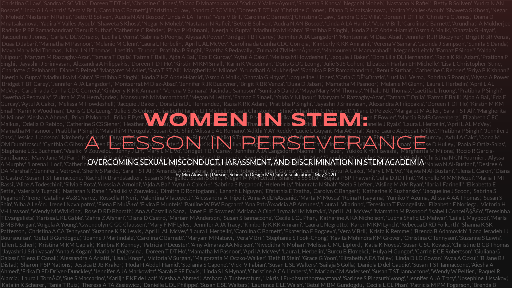

## Abstract

Inder Verma was a notable biologist at the Salk Institute who made significant contributions in the field of cancer biology during his time there. What is perhaps even more notable is that it took nearly four decades for his numerous accounts of sexual misconduct against his female colleagues and students to come to public light, and as a result, consequences to be decreed.

He is but just one example out of hundreds of men in STEM academia who have used their status and privilege to exploit women under their guidance and/or influence. Though the #MeToo movement has finally exposed the magnitude, breadth, and uniformity of the female experience of sexual misconduct globally, and ushered in a certain perspective shift in the way perpetrators of sexual misconduct are viewed, the playing field is still woefully uneven--women still must cope with the daily hazards of unearned male dominance. Women suffer financially, psychologically, and physically, especially in environments where men still dominate the field. The National Academy of Sciences reported in 2018 that the rate of sexual harassment in STEM is second only to that of the military. 

In “Women in STEM: A Lesson in Perseverance”, I explore different facets of sexual misconduct, harassment, and discrimination in STEM academia to highlight how the environment has protected perpetrators of sexual misconduct, and facilitated a self-perpetuating gender gap to this day. By combining insights from a database of publicly reported academic misconduct cases, reports from investigative journalism, and gender metadata pulled from scientific journal databases, I provide a comprehensive view of the harsh environment for women in STEM. I hope that this will buoy and increase efforts in advocacy for women’s rights both in and out the STEM field, as well as recognize the resilience and significance of women who have pursued and are pursuing careers in STEM.

## Process

### Initial project dev

My original intention for my MSDV thesis was to explore the dynamics of consent--shedding light on the fact that everyone has different perspectives on what constitutes sexual and physical consent, and because this is so, we must not assume that our way of communication, our boundaries, and our comfort levels reflect those of who we interact with. I wanted to track myself and several volunteers of diverse demographic background to record daily transgressions and interactions that merit consent. I wanted to make the gray area of "wait, was I actually okay with that?" clear in the form of data, provide a platform that lets users explore their boundaries and create their own "data portraits" of consent, and thus help educate people on the nuances surrounding the matter.

Then, COVID-19 took over the NYC. All of a sudden, we were on lockdown, and it was no longer possible for us to have physical interactions with each other. Though in a way it produced good results (less people getting harassed on the streets, less people fending off unwanted advances, etc), it was a death sentence for my original thesis project. I had already collected preliminary data from research academics had conducted around the sexual consent, relationships, and law enforecement surrounding this, and had started initial tracking of my own interactions with people. However, it was time to rethink what to do.

I decided to revisit a topic that has always been close to my heart, and that I have worked on previously: women in STEM and the difficult environment many of them must endure in order to pursue careers in STEM fields (science, technology, engineering, mathematics and related fields). I wanted to tie in how a systemic lack of education surrounding sex, sexual consent, and harassment has left us with generations of people--lawmakers, leaders, politicians--who do not have a clear understanding of what proper treatment of humans actually look like. When these people enforce law and order, significant problems arise in society on a macroscale level. This is particularly true in environments where men dominate--like in STEM. The National Academy of Science reported in 2018 that women in STEM experience the highest rate of sexual harassment of any profession outside of the military.

You can find documentation of my original thesis ideas and wireframes [here](https://github.com/miopio/thesis)

### Data Acquisition

The data was pulled from several locations:

1. [Planned Parenthood Consent Survey 2015](https://www.plannedparenthood.org/files/1414/6117/4323/Consent_Survey.pdf)

The consent survey was used to create static svg graphics of particular questions that best reflected varying perspectives in consent and sexual assault.

2. [Academic Sexual Misconduct Database](https://academic-sexual-misconduct-database.org/)

This database is being maintained under the leadership of Julie Libarkin, a professor of Earth Sciences and director of the Geocognition Laboratory at Michigan State University. 

3. Various news sources regarding specific perpetrators of misconduct (only published those with multiple news sources)

Detailed reports were put together for fifteen cases which resulted in outcomes in 2018. For every STEM case with outcomes in 2018 (54 cases), I researched the year of first known incident, the year of first known complaint, and year of initial outcome. Out of those 54 cases, I picked fifteen of them with the most concrete dates and evidence, and researched their cases further. These are the fifteen: Robert Kurzban, Stanton Glantz, Karl Kjer, Thomas Jessell, Lawrence Krauss, Francisco Ayala, William Kelley, Todd Heatherton, Terry Speed, George Tyndall, Harvey Makadon, Richard Vogt, Eugene Redmond, and Inder Verma.

4. [Journal publication metadata from MEDLINE Database](https://www.nlm.nih.gov/bsd/medline.html)

Names of women who have published in scientific journals were pulled from the MEDLINE database. I had pulled the metadata of ~1,000,000 papers published in the neuroscience field, and subsequently ran the first names of all authors through the Genderize API. More specifics on this process can be found [here](https://github.com/miopio/indStudy)

### Wireframes & Prototype

You can find a prototype for my platform [here](https://www.figma.com/proto/CFIKolSatBhxh55bWlHawg/MS2-Thesis-Wireframes?node-id=4009%3A1&scaling=min-zoom)

Wireframes and inspiration for graphs can be found [here](https://www.figma.com/file/CFIKolSatBhxh55bWlHawg/MS2-Thesis-Wireframes?node-id=4000%3A0)

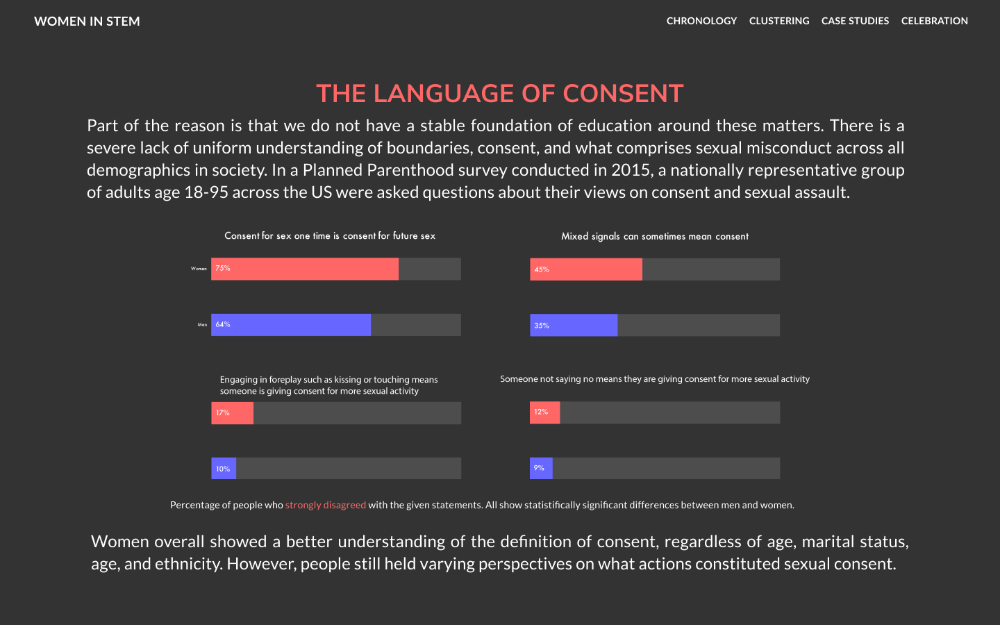
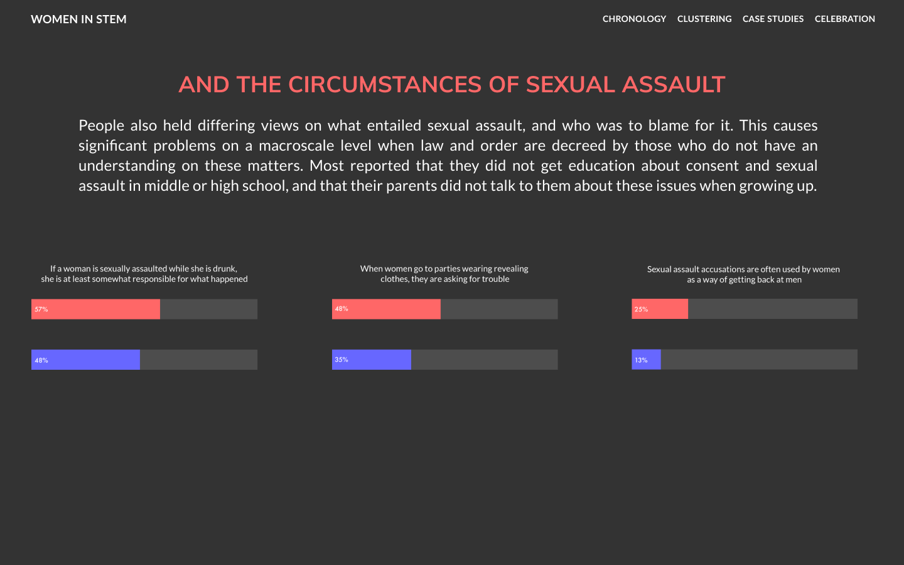
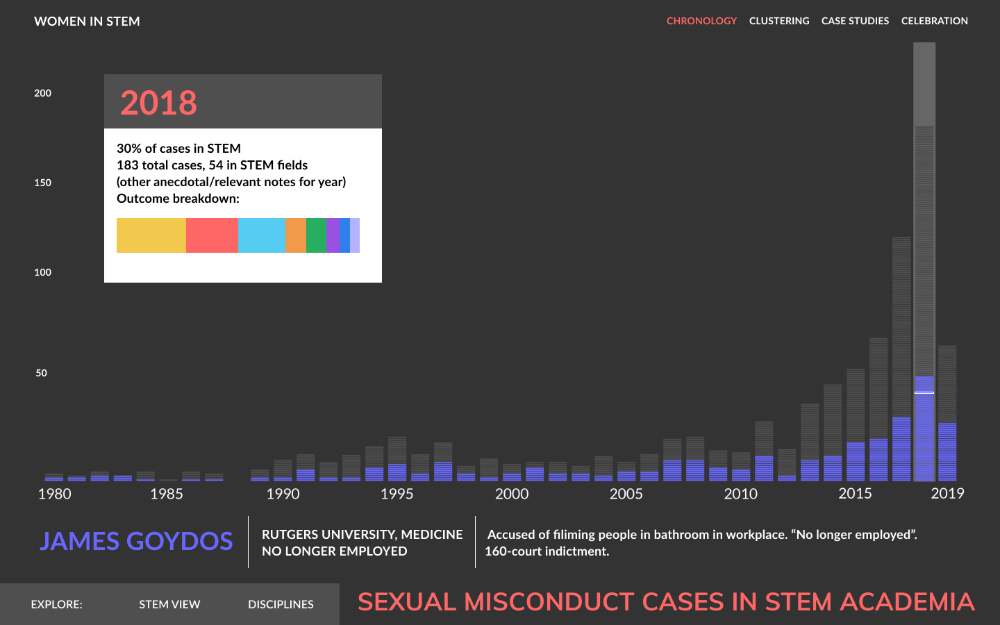
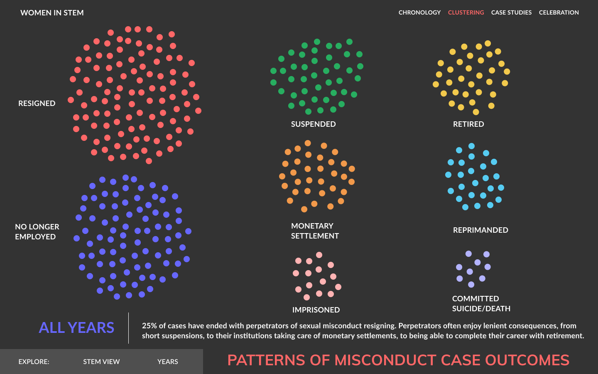
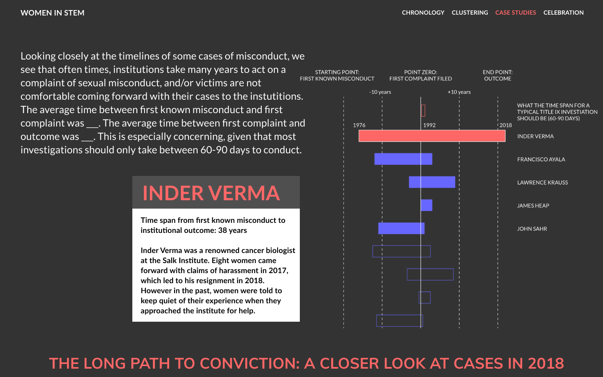

### Working version

INTRO - Introduction to societal events that recently shifted the conversation surrounding sexual harassment and equality for women, like the #MeToo movement. Point out the fact that sex and consent education is severely lacking in the US, evidenced by the variance in answers regarding situations surrounding sexual consent and sexual assault from the Planned Parenthood Survey. Point out that stats are bad especially in STEM. 

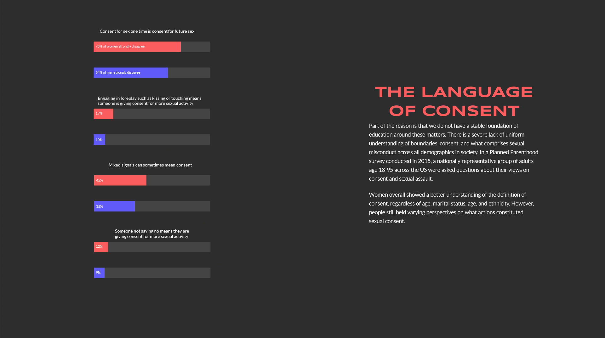
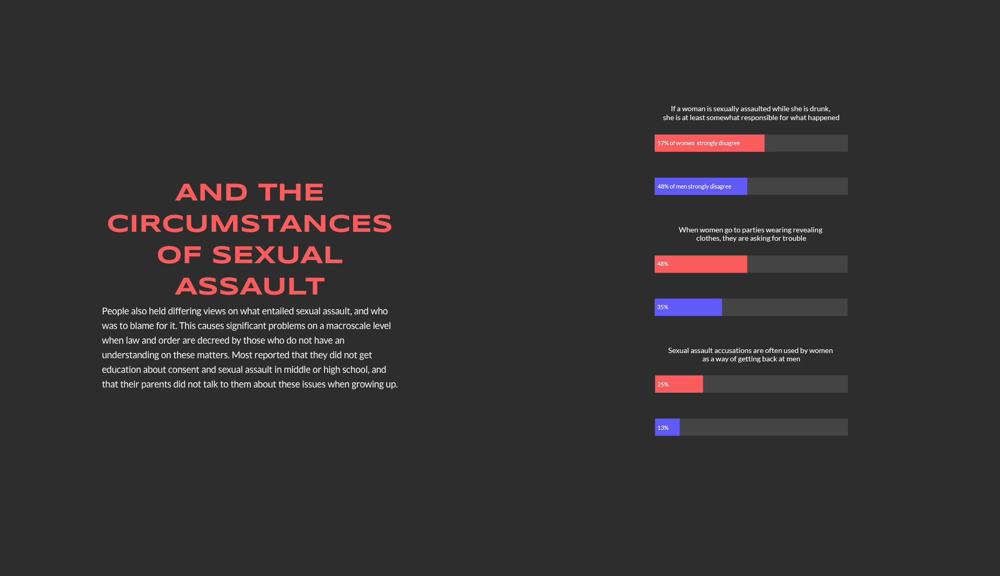

CHRONOLOGY - Timeline visualization of academic sexual misconduct cases, first all cases, then STEM. Go through significant events that propogated more public reporting of cases, including the first case where Title IX was used as grounds to classify sexual harassment as sex discirmination and thus illegal in educational institutions receiving federal funding. Anita Hill's testimony against Clarence Thomas during his Supreme Court nomination, as well as the advent of the MeToo movement are also highlighted.

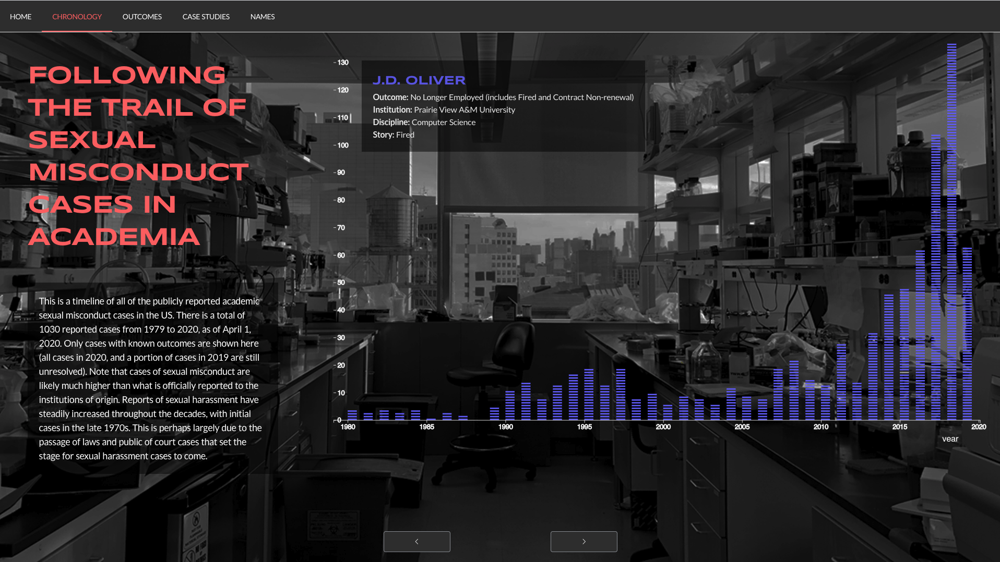

OUTCOMES - Shift the focus to the outcomes of STEM misconduct cases: these are clustered first by outcomes, then discipline, then institution. Though 20% of cases result in perpetrators getting fired, many cases result only in casual consequences for the perpetrators.

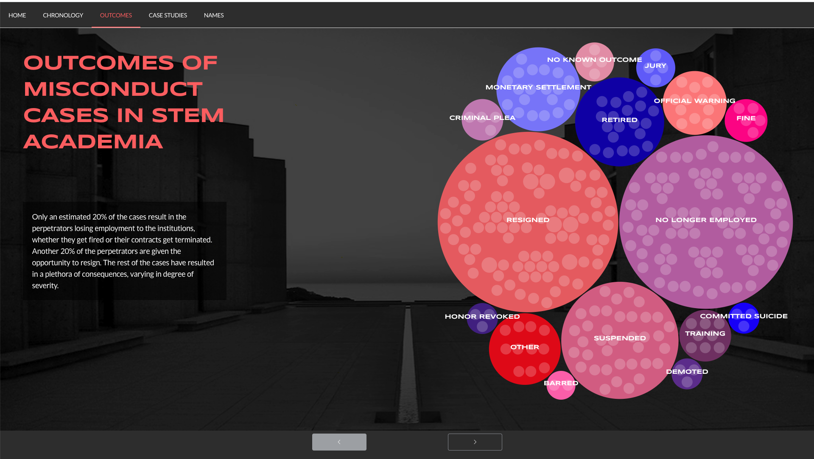

CASE STUDIES - Case studies of fifteen perpetrators whose cases resulted in outcomes in 2018. The years between first known incident, first complaint, and initial outcome are compared. Though the Office of Civil Rights previously advised that a typical Title IX investigation should only take 60-90 days, it is evident that many take decades before an outcome is achived. Many institutions do not act on first complaint, especially if perpetrators are prominent scientists that have done significant research, or bring in large amounts of funding to the institution.

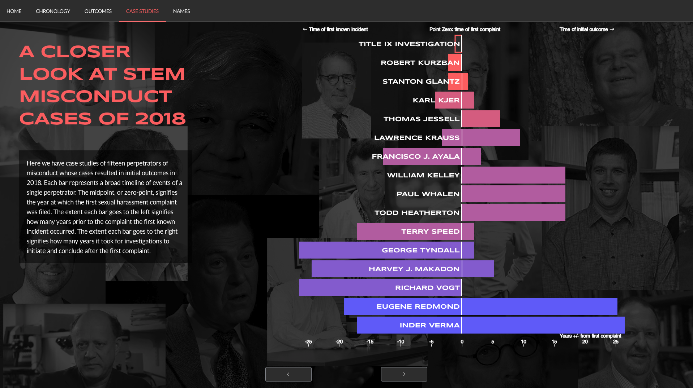

NAMES - the title image is tiled with names of women in STEM who have published in scientific journals. I wanted to highlight the women who have successfully pursued careers in STEM academia, despite the setbacks that are set forth in this research. We must continue to work to fix these deep systemic flaws in our academic institutions and society, and continue to empower and mentor women in their careers, both in STEM and beyond.

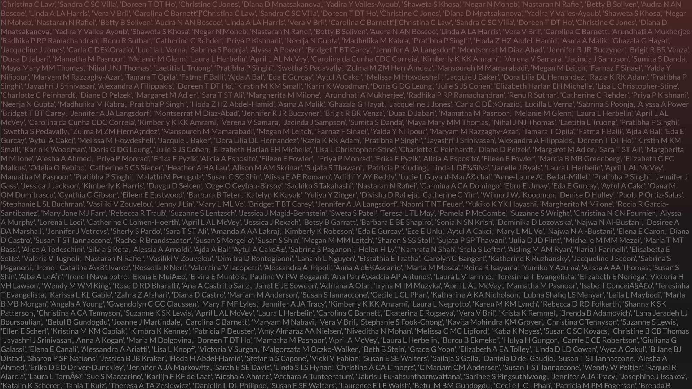

## Build Setup

```bash
# install dependencies
$ npm install

# serve with hot reload at localhost:3000
$ npm run dev

# build for production and launch server
$ npm run build
$ npm run start

# generate static project
$ npm run generate
```

For detailed explanation on how things work, check out [Nuxt.js docs](https://nuxtjs.org).


