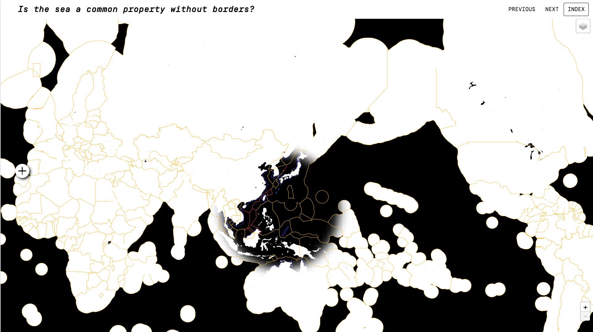
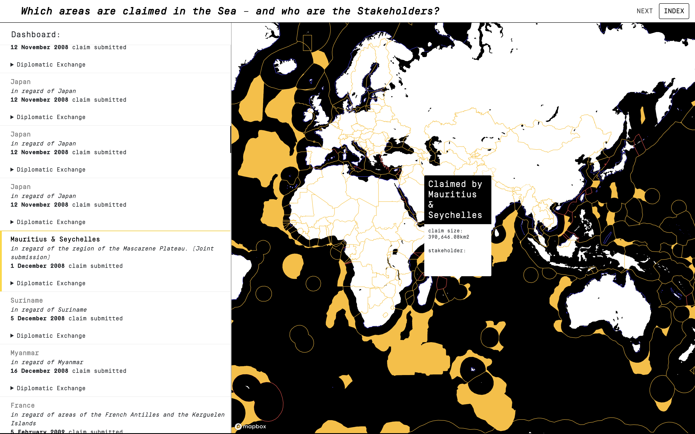
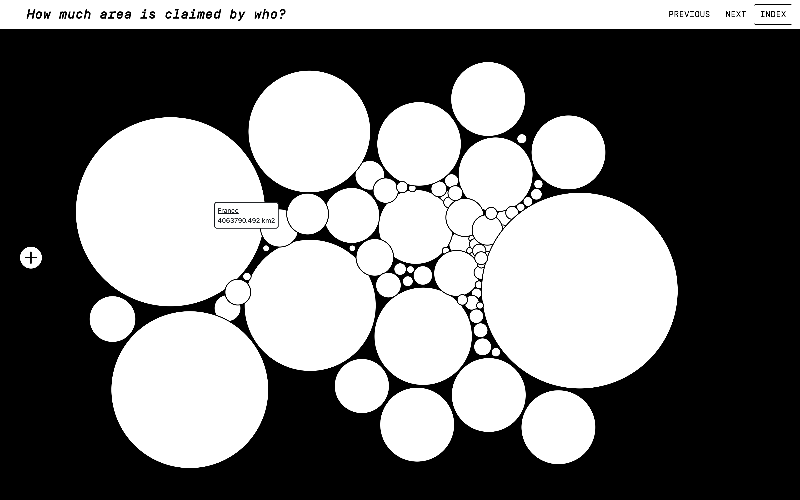
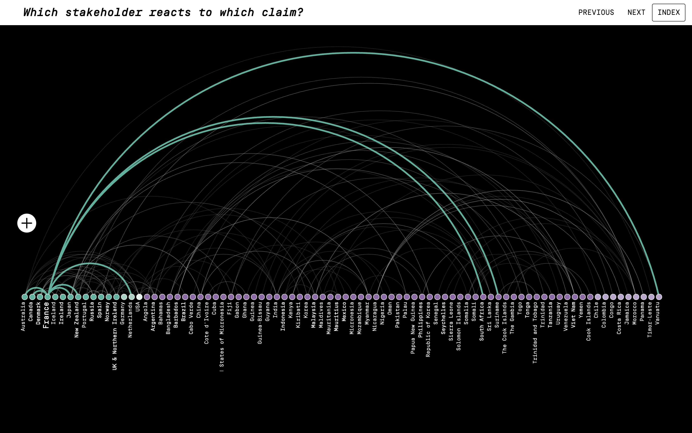

# With Compliments to the Secretary General
## Visualizing Maritime Claims at the UN in regard to the Continental Shelf
#### Researched, Designed & Developed by Robin Coenen, 2020

#### Abstract
Unlike the landmass, divided by many borders into different states, most of our maps and mental images represent the sea free of any delimitations.
This however does not depict reality.  
A large part of the ocean, similar to the landmass, is divided into different territories, respectively zones, adherent to their coastal states. The majority of these zones are now legally regulated by the Convention on the Law of the Sea, initiated by the UN in 1982 and entered into force in 1994.   
Most relevant for this project is the 200 nautical miles big "Exclusive Economic ZoneÂ". Within this zone states have the exclusive right to exploit all living and dead resources. Furthermore Article 76 of the Convention on the Law of the Sea provides UN Member States the rights to claim exclusive economic territory even beyond these 200 nautical miles.
This thesis argues that boundaries are contested, and that visualizing the claims of sovereign states upon ocean territories will make the legal and political implications on the continental shelf apparent to the public. It sharpens the surrounding blur of the claims, generated by complex scientific, juridical and diplomatic processes, and reveals their actual motives:  
Which area is claimed and which stakeholders are involved in that claim? How much new exploitable area is gained through the claim?  
The level of transparency created by the visualization will exert beneficial pressure on those states to abide by agreements and to take care in territorial ambitions. It furthermore renders the claims and their effects understandable and visible to the general public.  
This thesis ultimately also contextualizes the nature of the Convention on the Law of the Sea itself: Does the convention aggregate or counteract already existing inequalities between countries?  
An original dataset will be compiled from all 85 executive summaries of the current continental shelf submissions as well as their accompanying diplomatic notes, both housed in digital UN archives. This dataset will be fully integrated into a web based dashboard with visual representations and a detailed commentary upon the possible repercussions of this revisioning of the world oceans. Over and above that, the aggregated data will also be published as a stand alone, open source and documented dataset for the common good.

###### Credits
This project is designed, researched & developed by Robin Coenen in partial fulfillment of the requirements for the degree of Master of Science in Data Visualization, at Parsons The New School for Design. The advisors are Daniel Sauter & Aaron Hill.

###### Sources
Exclusive Economic Zone, Contiguous Zones, Territorial Seas:  
Flanders Marine Institute (2019). Maritime Boundaries Geodatabase, version 11. Available online at https://www.marineregions.org/. https://doi.org/10.14284/382.
Executive Summaries of all Claims and related Diplomatic Exchange:    
https://www.un.org/Depts/los/clcs_new/commission_submissions.htm

#### Thesis in Production, v1.6
#### Thesis Research here : https://github.com/robincoenen/thesis