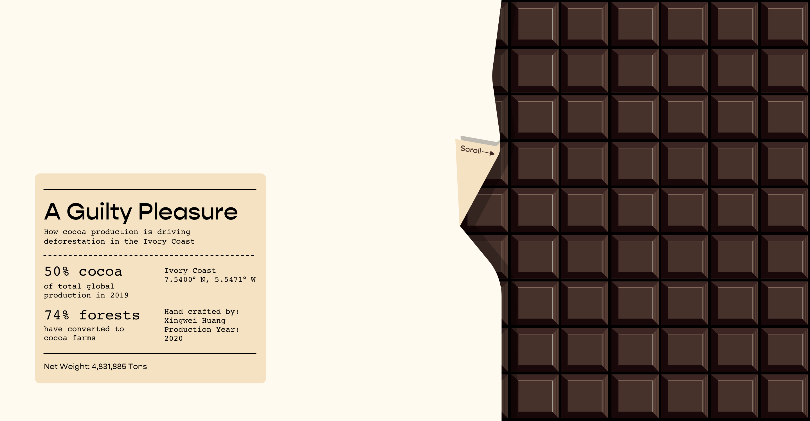
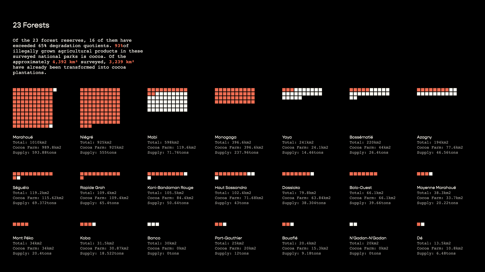
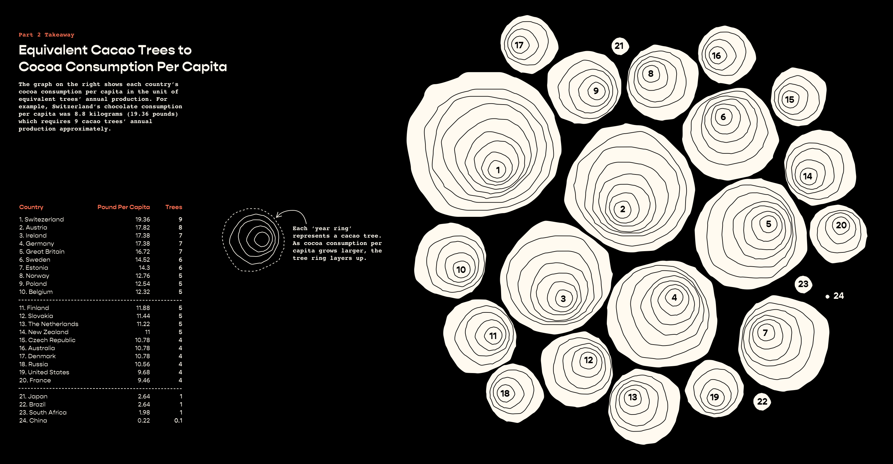
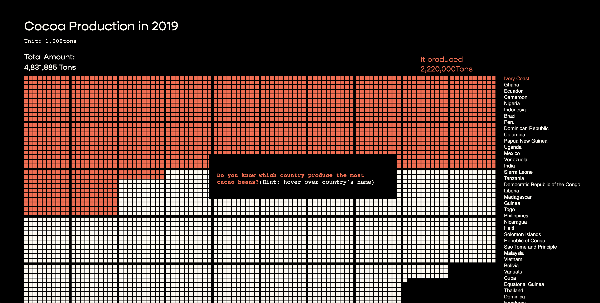
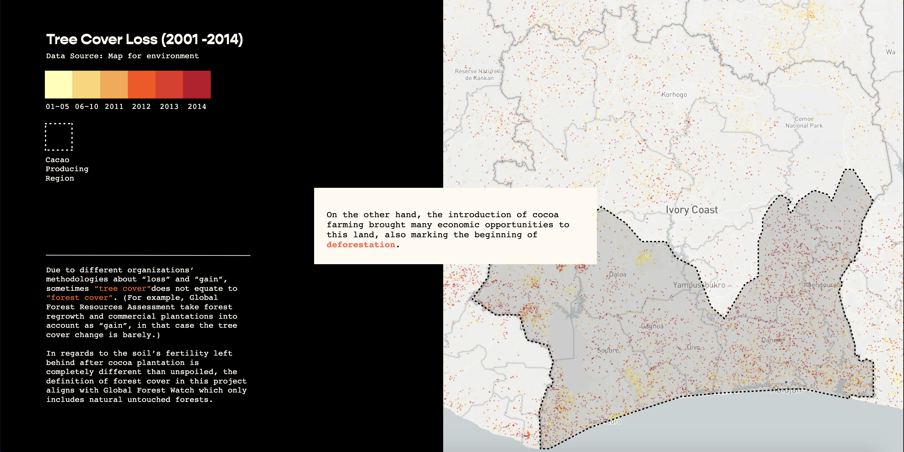

# A Guilty Pleasure

**How Cocoa Production is Driving Deforestation in The Ivory Coast**

> Masters Thesis in Data Visualization from Parsons School of Design, May 2020
> By Xingwei Huang

[Project Link](https://xingwei726.github.io/MSthesis/)

## Table of Contents

 - [Abstract](https://github.com/Xingwei726/MSthesis#Abstract)    
 - [Treatment](https://github.com/Xingwei726/MSthesis#Treatment)
 - [Data Sources](https://github.com/Xingwei726/MSthesis#Data-Sources)
 - [Design Decisions](https://github.com/Xingwei726/MSthesis#Design-Decisions)
 - [Conclusion](https://github.com/Xingwei726/MSthesis#Conclusion) 
 - [Screen Captures](https://github.com/Xingwei726/MSthesis#Screen-Captures)
 - [Design Process](https://github.com/Xingwei726/MSthesis#Design-Process)
 - [Acknowledgements](https://github.com/Xingwei726/MSthesis#Acknowledgements)

## Abstract

*A Guilty Pleasure* aims to visualize how the monoculture cocoa industry is driving deforestation in the Ivory Coast. By drawing people’s attention to this issue, we would think about what’s the bittersweet price we’ve paid for each pound of chocolate? Through the bridges built between datasets, we could observe its conflicting role in tropical deforestation and impacts on local suppliers more closely. As the name *A Guilty Pleasure* suggests, demand and supply of cocoa beans has a duality nature whether on a consumer level or through an economical perspective. Through the zooming-in lenses at Ivory Coast as a case study, users will be able to form their own unbiased conclusion out of the dots and to consider what could be done to achieve a sustainable model.

## Treatment

    - I. Cocoa Affection 
    - II. From Beans to Bars 
    - III. As Cocoa Grows
    - IV.Behind the Barcode

Inspired by the explanatory genre of a storytelling data visualization’s structure, this project adopts the scrolly-telling method which allows audiences to dive into the data stories at their own paces. A scrolled based transition will guide them through sections while visualization automatically synchronizes with descriptive contexts. My target audiences are lay people who aren’t professionals or experts in both the cocoa and chocolate industry, therefore in order to avoid faultage of conception, I included definitions for some terminology words that appeared in the visualization.

Considered the vast scope of datasets and how verbose the webpage length could become. Instead of arranging all contents on the same page and involving an “endless” scrolling, I decided to divide them into four sections based on the internal dependency. Meanwhile the section sequence is tailored based on narrative logics which will make the datasets and statements suggested in this project more pellucid to my target audiences.

## Data Sources 

The fundamental purpose of this study is to identify how the cocoa industry is driving deforestation in Ivory Coast, through understanding what triggered the issue, we would remedy the problem with potential solutions.

This project isn’t based on a singular data source and requires aggregating multiple available datasets together in order to offer the breadth and depth analysis on this topic. In section 3 As Cocoa Grow I also included the evidence and research from previous studies about Ivory Coast’s ecosystem and forests which can support the strong correlation between cocoa plantation and deforestation.

Datasets used in this project were mostly collected from governmental or non-profit organizations dedicated to environment study or forests’ monitoring. Some datasets were collected from cocoa focused organizations such as ICCO (International Cocoa Organization), World Cocoa Foundation and ICI (International Cocoa Initiative). When I use the datasets from these specialized organizations, I would compare them with other sources too, not because of questioning authority or credibility, but to confirm the definition of certain terms align with general cognition through weighing out the data points. For example, in the dataset about global cocoa production in 2019, does the *cocoa* refer to raw beans or finished products ( in powder format)? After comparing across all other datasets, if the numbers fall into a certain range then I would be able to confirm it’s the right one, if numbers conflict or dramatically different then I would go back to each dataset’s methodology behind to see which one is more reliable.

| Data | Description |
|--|--|
| Global Cocoa Production in 2019 | Gro Intelligence, "As Cocoa Harvest Begins, Risks Emerge From Major ...." 24 Oct. 2019 |
| Global Cocoa Trade | Gro Intelligence, "Developing Economies Challenge Europe's Chocolate Reign ...." 16 May. 2018 |
| Global Cocoa Trade Data | Resource Trade.Earth, The trade data on this site are from the Chatham House Resource Trade Database (CHRTD) |
| World cocoa bean production, grindings and stocks | International Cocoa Organization |
| Information Sheet on Cocoa |Food and Agriculture Organization of the United Nations |
| Chocolate: The Journey from Beans from Bars | Rainforest-alliance.org |
| Cocoa Farming and Primate Extirpation Inside Cote D'ivoire's Protected Areas |SAGE JOURNALS |
| The production process – from cocoa beans to semi finished products |European Cocoa Association |
|  |  |

**Other References**
- Tropical Conservation Science
- International Monetary Fund
- WorldAtlas
- NJAS - Wageningen Journal of Life Sciences
- Global Ecology and Conservation
- Tropical Conservation Science
- Yale Environment 360

## Design Decisions

This thesis project went through a long process from ideation, mind-map, prototyping, data cleaning to final execution. I’m using d3.js as the main language in this project, in some sections I also utilized Mapbox GL to present the spatialized data. Following paragraphs will explain some of my design decisions with details.

Users land on a homepage which adopts a horizontal scrolling structure. The “chocolate label” on the homepage summarizes my project title and provides a glance at the topic but not giving away too much information at the same time. As they scroll to the right side, it feels like unwrapping a chocolate bar and it also reveals the introduction about this project as well as a menu of each section’s title. Although users may choose any section to begin with, the suggested order is from PART1 to PART4. Within each section they can always navigate forward or backward.

At the end of each section, I highlighted one of the main takeaways as a summary, then it ends with a question which would open the discussion of the next section. Echoing to the project homepage, endpage adopts the form of a chocolate bar’s back packaging. Here the “chocolate label” summarizes credits and acknowledgement information.

## Conclusion
Because demand for cocoa beans is always on the rise, it’s more than urgent to rethink and establish a healthy and sustainable ecosystem for cocoa beans. We can’t undo what’s already been done, but we can prevent history from repeating again and again. Through identifying each type of deforestation that has taken place during the cocoa cultivation process, we would remedy the problem with potential solutions. One of them is to advocate a better alternative to monoculture farming method which is agroforestry. Some farming sites have already put the method into test and the result is positive. My hope is that with more and more research being done in multi-functionality comparisons, it could help scientists and decision makers to determine long-term strategies which would use plant biodiversity as an actionable lever to adapt and mitigate climate change. Meanwhile, in order to strategize for future increase, this sustainable approach can also address the relationship between cocoa plantation and natural environment. Besides supporting chocolate companies who are dedicated to creating chocolate from deforestation-free cocoa beans, as customers we can also minimize our food waste footprint to appreciate the hardship behind every production.

However, the deforestation issue is still an intricacy. Although Ivory Coast is considered to be the largest supply for cocoa and their forests cover rate has dramatically dropped during the last few years. The correlation doesn’t necessarily suggest a one-and-only relationship because they also have large quantities’ exports of agricultural products such as coffee and nuts. It would overgeneralize the problem by saying cocoa is the only factor that accounts for deforestation in Ivory Coast. Which also means, cocoa production only accounts for a bigger percentage of the problem compared to others, a sustainable supply chain won’t eliminate deforestation completely but would alleviate the current situation and inspire other industries to switch their patterns.

## Screen Captures

## Design Process

For more details about the thinking and design process behind this project, please visit :

[Mindmap](https://github.com/Xingwei726/MSthesis/tree/master/process/mind%20map)

[Storyboard](https://github.com/Xingwei726/MSthesis/tree/master/process/storyboard)

## Acknowledgements
*A Guilty Pleasure* was created by [Xingwei Huang](http://xingwei.work/) in support of a graduate school thesis for the Masters of Science in Data Visualization at Parsons School of Design.

This thesis would not have been possible without the help of Parsons MSDV faculty, special thanks for Daniel Sauter, Aaron Hill, Alec Barrett, Richard The, Christian Swinehart and Maria Massei-Rosato. 

Additionally, the completion of this project could not have been accomplished without the support from the rest of the [2020 MSDV cohort](https://github.com/visualizedata/msdv-thesis-2020)! I'm more than grateful to meet you guys during this adventurous 'odyssey'.
