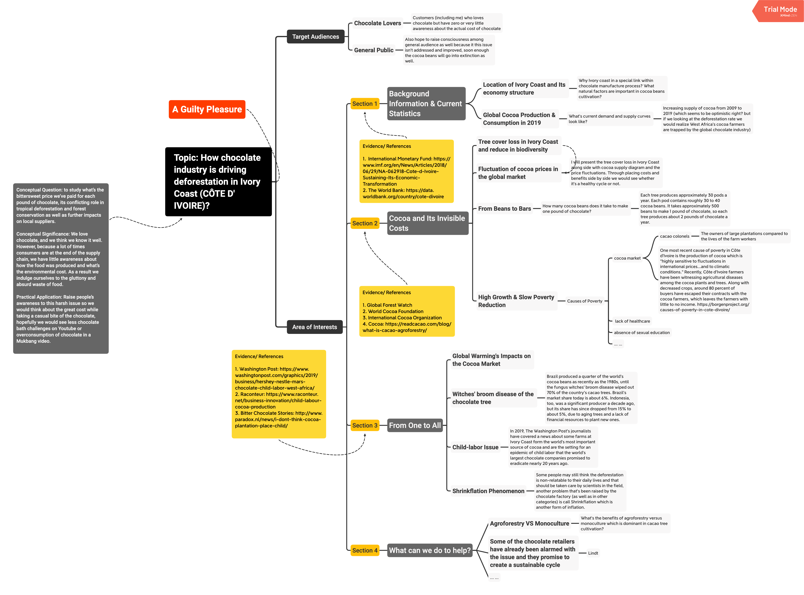

# **A Guilty Pleasure**

Thousands of miles away from the American and European homes where the majority of the world’s chocolate is devoured, lies the denuded landscape of West Africa’s Ivory Coast. The nation is the world’s largest producer of cocoa, the raw material for chocolate. As its name suggests, elephants once abundantly roamed the rainforests of Ivory Coast. Today’s reality is much different: many of the country’s national parks and conservation lands have been cleared of their forest to make way for cocoa operations to feed demand from large chocolate companies like Nestlé, Cadbury, and Mars.

The Ivory Coast has lost 80% of its forests over the last 50 years, and 40% of the world’s cocoa comes from there. The ballooning global demand for chocolate means that if nothing is done, by 2030 there will be no forest left. The final, insulting irony is that locals are so poor they could never afford to eat a chocolate bar.

Mindmap

## **Research Topic**

-   **Topic:** I am visualizing how (monoculture) chocolate industry is driving deforestation in Ivory Coast (CÔTE D'IVOIRE).
-   **Conceptual Question:** to study what’s the bittersweet price we’ve paid for each pound of chocolate, its conflicting role in tropical deforestation and forest conservation as well as further impacts on local suppliers.
-   **Conceptual Significance:** We love chocolate, and we think we know it well. However, because a lot of times consumers are at the end of the supply chain, we have little awareness about how the food was produced and what’s the environmental cost. As a result we indulge ourselves to the gluttony and absurd waste of food.
-   **Practical Application:** Raise people’s awareness to this harsh issue so we would think about the actual cost while taking a respectful bite of the chocolate, hopefully we would see less chocolate bath challenges on Youtube or overconsumption of chocolate in a Mukbang video.

  

## **Section One / Introduction & Background**

To overcome Ivory Coast's excessive dependence on coffee and cocoa, the government in the mid-1970s embarked on a series of agricultural diversification and regional development projects with the hope of boosting agricultural production by 4 percent per year. The plan would allow the country to become self-sufficient in food and expand the production of rubber, cotton, sugar, bananas, pineapples, and tropical oils. In spite of these efforts, the agricultural sector appeared unable to adapt to changing conditions...

**Contents**

-   Location of Ivory Coast & Its economy structure
-   High growth but slow poverty reduction: Ivory coast has experienced strong but decelerating growth while the decline in poverty has been modest.
-   World cocoa production by country in 2019
-   World cocoa consumption by country in 2019
-   From bean to bar, 400 dried beans are required to make one pound (454 grams) of chocolate; Each **tree** produces approximately **30 pods** a year. Each **pod** contains roughly **30 to 40 cocoa beans**. It takes approximately **500 beans** to make **1 pound** of chocolate, so each **tree** produces about **2 pounds of chocolate a year**.

 
**Function**

This section will give audience an introduction about why Ivory coast in a special link within chocolate manufacture process. What natural factors are important in cocoa beans cultivation?

What’s current demand and supply curves look like? And how many cocoa beans does it take to make one pound of chocolate?

**Evidence/ References**

- International Monetary Fund: 

[https://www.imf.org/en/News/Articles/2018/06/29/NA-062918-Cote-d-Ivoire-Sustaining-Its-Economic-Transformation](https://www.imf.org/en/News/Articles/2018/06/29/NA-062918-Cote-d-Ivoire-Sustaining-Its-Economic-Transformation)

- BBC Country Profile:

[https://www.bbc.com/news/world-africa-13287216](https://www.bbc.com/news/world-africa-13287216)

- The World Bank: 
[https://data.worldbank.org/country/cote-divoire](https://data.worldbank.org/country/cote-divoire)

  

  

## **Section Two / Cocoa and Its Invisible Costs**

**Contents**

-   Increasing supply of cocoa from 2009 to 2019 (which seems to be a good news? but if we looking at the deforestation rate we would realize West Africa’s cocoa farmers are trapped by the global chocolate industry)
-   Agroforestry VS Monoculture
-   Tree cover loss in Ivory Coast and reduce in biodiversity
-   Fluctuation of cocoa prices in the global market

**Function**

This section is the main part of the project, it will present the tree cover loss in Ivory Coast along side with cocoa supply diagram and the price fluctuations. Through placing costs and benefits side by side we would see whether it’s a healthy cycle or not. Also audiences will grasp an understanding about what’s the benefits of agroforestry versus monoculture which is dominant in cacao tree cultivation.

**Evidence/ References**

-   Global Forest Watch
-   World Cocoa Foundation
-   International Cocoa Organization
-   Cocoa Magazine: [https://readcacao.com/blog/what-is-cacao-agroforestry/](https://readcacao.com/blog/what-is-cacao-agroforestry/)

  
## **Section Three / From One to All**

Chocolate has a long history which can traced back to 1900 BC, this project isn't aim to stop people from eating chocolate but to raise awareness and to discuss how can we create a sustainable supply chain under the increasing demand of it. And most importantly chocolate is just one of the products that we've been taken for granted while never consider its costs, if we don't change our devouring habit, this won't be the only food that goes into extinction soon.

**Contents**

-   How does **global warming** (temperature, insect infections etc) has worsen the situation?
-   **Child-labor Issues:** In 2019, The Washington Post’s journalists have covered a news about some farms at Ivory Coast form the world’s most important source of cocoa and are the setting for an epidemic of child labor that the world’s largest chocolate companies promised to eradicate nearly 20 years ago.
-   **Shrinkflation** Phenomenon: Some people may still think the deforestation is non-relatable to their daily lives and that should be taken care by scientists in the field, another problem that’s been raised by the chocolate factory (as well as in other categories) is call Shrinkflation which is another form of inflation.
-   Optimistic Side: Some chocolate retailers are taking actions to make it sustainable
-   Bad Phenomenon: Chocolate waste on Youtube

  

**Function**

Unsustainable cocoa beans supply is not only harmful to the environment would also trigger ethical human issues. This section will discuss the spectrum of cost as well as what are some actions that’s already been considered. As a consumer what can we do in order to help the situation instead of letting the chocolate goes into extinction, that goes into the thinking about other food we’ve taken granted as well.

**Evidence / References**

- Washington Post: 

[https://www.washingtonpost.com/graphics/2019/business/hershey-nestle-mars-chocolate-child-labor-west-africa/](https://www.washingtonpost.com/graphics/2019/business/hershey-nestle-mars-chocolate-child-labor-west-africa/)

- Raconteur:

[https://www.raconteur.net/business-innovation/child-labour-cocoa-production](https://www.raconteur.net/business-innovation/child-labour-cocoa-production)

- Bitter Chocolate Stories: 

[http://www.paradox.nl/news/i-dont-think-cocoa-plantation-place-child/](http://www.paradox.nl/news/i-dont-think-cocoa-plantation-place-child/)
