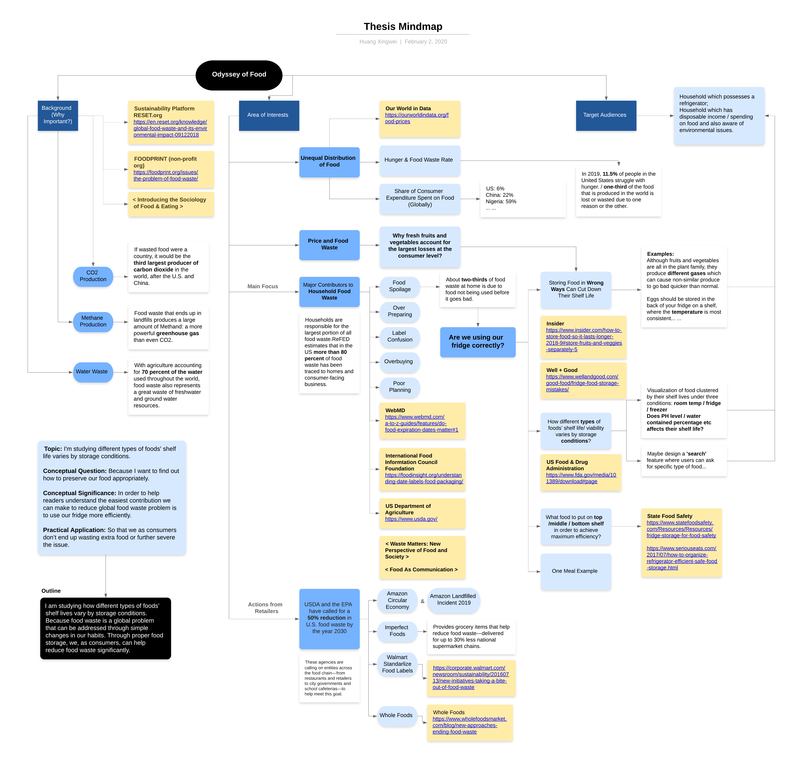

# Odyssey of Food

Mindmap

## **Research Topic**

-   **Topic:** I am visualizing how different types of foods’ shelf life varies by storage conditions.
-   **Conceptual Question:** Because I want to find out how to preserve our food appropriately.
-   **Conceptual Significance:** Help readers understand the easiest contribution we can make to reduce global food waste problem is to use our fridge more efficiently.
-   **Practical Application:** So that we as consumers don’t end up wasting extra food or further severe the issue.

## **Section One / Background ( Why is it important to know? )**

**Learning Objective:**

-   This section will explain why global food waste is a far-reaching problem with tremendous financial, ethical and environmental costs.
-   Some obvious related environmental issues that’s been triggered with food waste are **CO2 production**, **methane gas production** and **water waste**.
-   The history of food waste is closely linked to globalization. In an ever more networked world, supply chains get longer, and everything is available everywhere.

**Function:**

-   Give audiences an introduction about the topic and background information including how serious this problem is before presenting numbers to them directly.
-   Although everyone acknowledge the issue, a Natural Resources Defense Council study of food waste in several cities found that 76 percent of people think they throw away less food than the average American.
-   Because we don’t see our own waste so there’s still a disconnect between being aware that this is a global problem and connecting that to what you’re actually doing when you scrape your plate into the garbage.

**Evidence/ References:**

-   NRDC [https://www.nrdc.org/sites/default/files/food-matters-ib.pdf](https://www.nrdc.org/sites/default/files/food-matters-ib.pdf)
-   RESET [https://en.reset.org/knowledge/global-food-waste-and-its-environmental-impact-09122018](https://en.reset.org/knowledge/global-food-waste-and-its-environmental-impact-09122018)
-   Food Print [https://foodprint.org/issues/the-problem-of-food-waste/](https://foodprint.org/issues/the-problem-of-food-waste/)
-   Cramer, Janet M., Carlnita P. Greene, and Lynn Walters. _Food as Communication: Communication as Food_. New York: Peter Lang, 2011.
-   Stuart, Tristram. _Waste: the True Cost of What the Global Food Industry Throws Away_. London: Penguin, 2009.
-   Murcott, Anne. _Introducing the Sociology of Food & Eating_. London: New York : Bloomsbury Academic, 2019.
-   Food Waste from Field to Table: Hearing before the Committee on Agriculture, House of Representatives, One Hundred Fourteenth Congress, Second Session, May 25, 2016_. Washington: U.S. Government Publishing Office, 2016.

## **Section Two / Latest Statistics (How much food goes into waste by second?)**

**Learning Objectives:**

-   There will be a visualization ( such as time clock) to show the following information:
**63 million tons of food waste / year = 1811kg / second**
( In 2019 the United States spends over $218 billion – 1.3% of GDP – growing, processing, transporting, and disposing of food that is never eaten. 52.4 million tons of food is sent to landfill, and an additional 10.1 million tons remains unharvested at farms, totaling roughly 63 million tons of annual waste. )

-   In this section we will also learn about unequal distribution of food, share of consumer expenditure spend on food, there might be a possible correlation between expenditure percentage and food waste index.

**Function:**

Because my thesis’s purpose is to  ‘slow down’ the food waste clock, this part of visualization will not only showcase the statistic’s number of food waste, but also translate that number into other units  (such as monetary) so people get to understand what does it really mean. Using the question  ‘how much food goes into waste without consumption by second?’ to keep audience reading more in the next  ‘solution’ section.

 
**Evidence / References:**

-   Our world in Data: [https://ourworldindata.org/food-supply](https://ourworldindata.org/food-supply)
-   ReFED: [https://www.refed.com/downloads/ReFED_Report_2016.pdf](https://www.refed.com/downloads/ReFED_Report_2016.pdf)
-   National Geographic: [https://www.nationalgeographic.com/environment/2019/04/people-waste-more-food-than-they-think-psychology/](https://www.nationalgeographic.com/environment/2019/04/people-waste-more-food-than-they-think-psychology/)

## **Section Three / Food Odyssey (Are we using our fridge correctly?)**

**Learning Objectives:**

-   Households are responsible for the largest portion of all food waste. ReFED estimates that in the US **more than 80 percent** of food waste has been traced to homes and consumer-facing business. And about **two-thirds** of food waste at home is due to food not being used before it goes bad.
-   This section will include a visualization mapping of different types of food clustered by their shelf lives under three conditions: room temp / fridge / freezer. Through this visualization user can see which group of food spoil the fastest versus which food can be preserved longer  (under which condition)
**The visualization can provide evidence to further discuss the questions  such as :**
-Does PH level / water contained percentage etc affects their shelf life?
-how different types of foods’ shelf life / viability varies by storage conditions?

-   Another part of this section will show some storing food tricks as well as common mistakes.
-   (Potential) An anatomy of fridge in terms of which part has coldest and the stablest temperature.  --→ Which food to be put on top /middle / bottom shelf in order to achieve maximum efficiency?
-   (Potential) Using one meal as an example

**Function:**

This is the main part of this thesis, I hope through this visualization people  (including me) can learn some patterns between different kinds of food, so when it comes to grocery shopping we can plan the weekly consumption better. For example, if all desired food ingredients belong to the same category  (easiest spoilage section) then it’s better to buy less for each kind in order to be waste-free. Otherwise we can plan accordingly, buy a small portion of food that will be consumed right away while we can keep others longer in the fridge for later usage.

 
**Evidence / References:**

-   UNL food: [https://food.unl.edu/food-storage-chart-cupboardpantry-refrigerator-and-freezer](https://food.unl.edu/food-storage-chart-cupboardpantry-refrigerator-and-freezer)
-   foodsafety.gov: [https://www.foodsafety.gov/food-safety-charts/cold-food-storage-charts](https://www.foodsafety.gov/food-safety-charts/cold-food-storage-charts)
-   fda.gov: [https://www.fda.gov/media/101389/download#page](https://www.fda.gov/media/101389/download#page)

## **Section Four / Actions From Retailers**

**Learning Objectives:**

-   USDA and the EPA have called for a **50%**  **reduction** in U.S. food waste by the year 2030.
-   These agencies are calling on entities across the food chain—from restaurants and retailers to city governments and school cafeterias—to help meet this goal.
-   This last section will summarize some actions that’s been adopted by the retailers in order to reduce food waste.

**Evidence / References:**

-   Waste 360: [https://www.waste360.com/generators/usda-epa-announce-us-food-loss-and-waste-2030-champions](https://www.waste360.com/generators/usda-epa-announce-us-food-loss-and-waste-2030-champions)
-   Whole Foods: [https://www.wholefoodsmarket.com/blog/new-approaches-ending-food-waste](https://www.wholefoodsmarket.com/blog/new-approaches-ending-food-waste)
-   The Spoon: [https://thespoon.tech/newsletter-food-waste-innovation-in-2019-amazon-goes-to-nyc/](https://thespoon.tech/newsletter-food-waste-innovation-in-2019-amazon-goes-to-nyc/)
-   Spoiler Alert: [https://www.spoileralert.com/team](https://www.spoileralert.com/team)
-   Amazon Circular Economy: [https://sustainability.aboutamazon.com/packaging-and-products/closing-the-loop-on-waste](https://sustainability.aboutamazon.com/packaging-and-products/closing-the-loop-on-waste)
