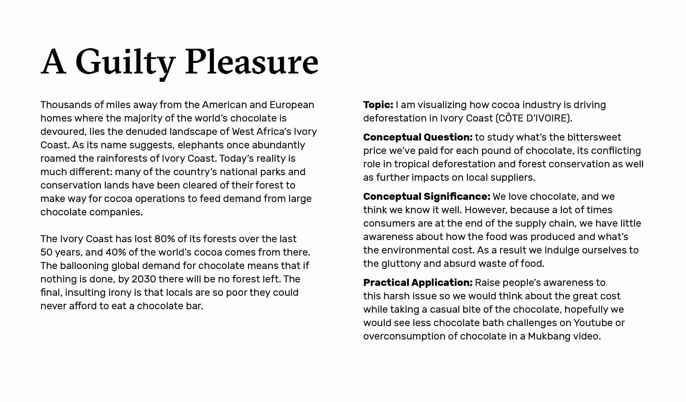
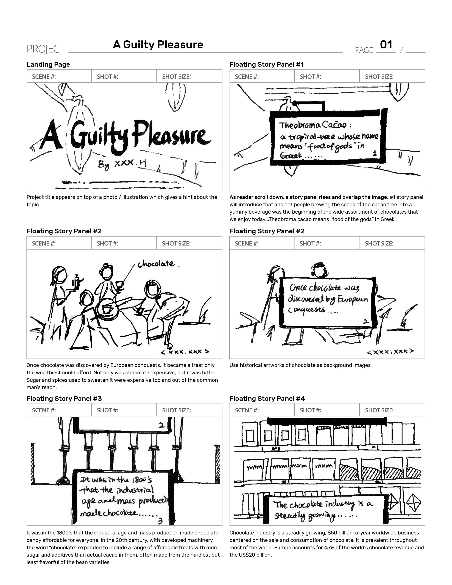
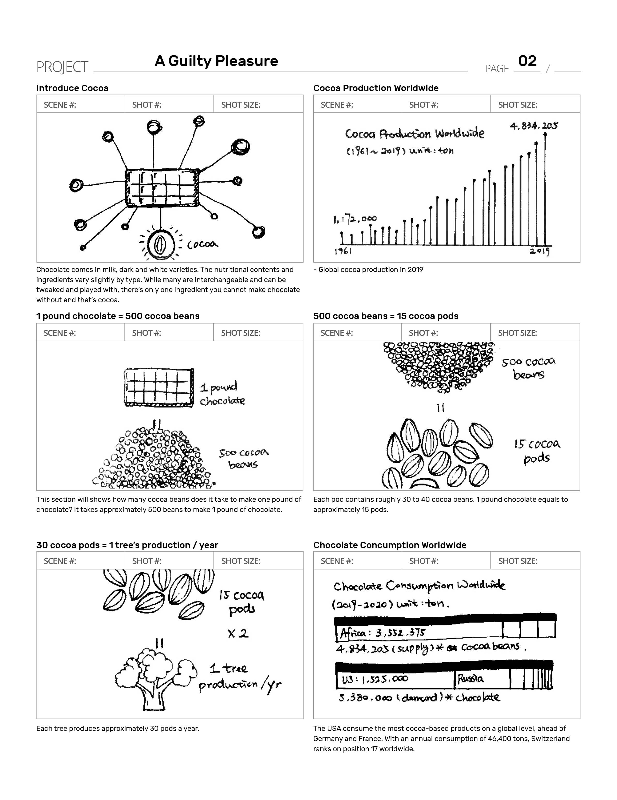
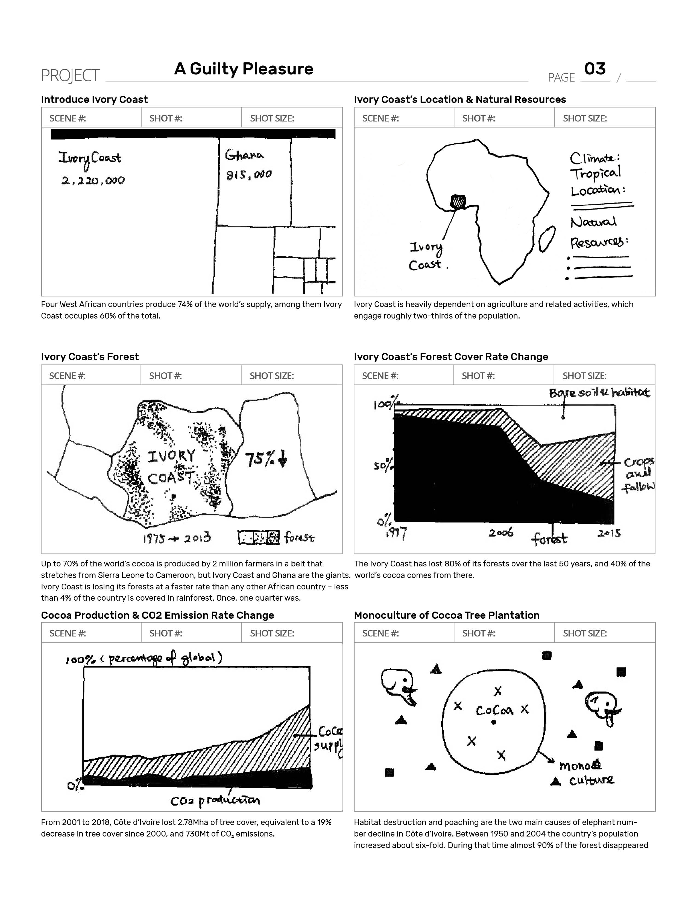

# Details

## S1 Chocolates’ History

Chocolate has been a favorite of man for thousands of years. Ancient people brewing the seeds of the cacao tree into a yummy beverage was the beginning of the wide assortment of chocolates that we enjoy today.

**Notes**

-   Project title appears on top of a photo / illustration which gives a hint about the topic

## S2~4 Chocolates in History

-   Chocolate is prepared from the fruit of the _Theobroma cacao_, a tropical tree whose name means  "food of the gods" in Greek, according to  "[Chocolate:](http://exhibits.mannlib.cornell.edu/chocolate/theobromacacao.php) [Food of the Gods](http://exhibits.mannlib.cornell.edu/chocolate/theobromacacao.php)," an online exhibit by the Cornell University Library.
-   Once chocolate was discovered by European conquests, it became a treat only the wealthiest could afford. Not only was chocolate expensive, but it was bitter. Sugar and spices used to sweeten it were expensive too and out of the common man's reach.

**Notes:**

-   As reader scroll down, a story panel rises and overlap the image. #1 story panel will introduce that ancient people brewing the seeds of the cacao tree into a yummy beverage was the beginning of the wide assortment of chocolates that we enjoy today.
-   Theobroma cacao means  “food of the gods” in Greek.
-   Use historical artworks of chocolate as background images

  

## S5~6 Chocolate in Modern Times

-   It was in the 1800’s that the industrial age and mass production made chocolate candy affordable for everyone. In the 20th century, with developed machinery the word  “chocolate” expanded to include a range of affordable treats with more sugar and additives than actual cacao in them, often made from the hardiest but least flavorful of the bean varieties.
-   Chocolate industry is a steadily growing, $50 billion-a-year worldwide business centered on the sale and consumption of chocolate. It is prevalent throughout most of the world. Europe accounts for 45% of the world’s chocolate revenue and the US$20 billion.

**Notes:**

-   Use chocolate industry production photo as background images
-   Use a picture of grocery store with different types of chocolate on the shelf
-   （Show top 10 chocolate brands)

  

## S7 Introduce cocoa

Chocolate comes in milk, dark and white varieties. The nutritional contents and ingredients vary slightly by type. While many are interchangeable and can be tweaked and played with, there’s only one ingredient you cannot make chocolate without and that’s cocoa.

**Notes:**

-   Maybe a static tree diagram to show different ingredients that a chocolate bar potentially contains, but not interactive because this is not the main part of the thesis project.
-   Increasing supply of cocoa from 2009 to 2019  (which seems to be a good news? but if we looking at the deforestation rate later we would realize West Africa’s cocoa farmers are trapped by the global chocolate industry)

  

## S8~11 From beans to bars

-   How many cocoa beans are we consuming each year?
-   From bean to bar, 400 dried beans are required to make one pound  (454 grams) of chocolate; Each **tree** produces approximately **30**  **pods** a year. Each **pod** contains roughly **30 to 40**  **cocoa**  **beans**. It takes approximately **500 beans** to make **1 pound** of chocolate, so each **tree** produces about **2 pounds of chocolate a year**.

**Notes:**

- This section will shows how many cocoa beans does it take to make one pound of chocolate? So audiences will have an idea about what does it really mean by consuming one pound of chocolate.

  

## S12 Chocolate Consumption Worldwide

-   The USA consume the most cocoa-based products on a global level, ahead of Germany and France. With an annual consumption of 46,400 tons, Switzerland ranks on position 17 worldwide.
-   Four West African countries produce 74% of the world’s supply, among them Ivory Coast occupies 60% of the total.

**Notes:**

I couldn’t found the exact data on the consumption of cocoa beans each year  (by each country) so maybe I will translate this into the same unit with cocoa data for readers to compare more easily.

  

## S13~14 Introduce Ivory Coast

-   Four West African countries produce 74% of the world’s supply, among them Ivory Coast occupies 60% of the total.
-   Ivory Coast is heavily dependent on agriculture and related activities, which engage roughly two-thirds of the population.

**Notes:**

-   Location of Ivory Coast & Its economy structure
-   This section gives audience an introduction about why Ivory coast in a special link within chocolate manufacture process. What natural factors are important in cocoa beans cultivation?
-   High growth but slow poverty reduction: Ivory coast has experienced strong but decelerating growth while the decline in poverty has been modest.

  

## S15~16 Ivory Coast Forest Cover Rate

-   This section is the main part of the project, it will present the tree cover loss in Ivory Coast from 1975 to 2015  (the latest data I can get)
-   Up to 70% of the world’s cocoa is produced by 2 million farmers in a belt that stretches from Sierra Leone to Cameroon, but Ivory Coast and Ghana are the giants. Ivory Coast is losing its forests at a faster rate than any other African country – less than 4% of the country is covered in rainforest. Once, one quarter was.

  

## S17 CO2 Emission Rate

From 2001 to 2018, Côte d’Ivoire lost 2.78Mha of tree cover, equivalent to a 19% decrease in tree cover since 2000, and 730Mt of CO₂ emissions.

**Notes:**

In order to set a contrast with the  “decrease” in forest cover rate, this section will adopt the same diagram choice to show the  “increase” that has been brought by the cocoa industry in other areas, eg CO2 emission rate.

  

## S18 Monoculture & Biodiversity

As Ivory Coast’s name suggests, elephants once abundantly roamed the rainforests of Ivory Coast. However because of habitat destruction and poaching, elephant number declined in Ivory Coast. Between 1950 and 2004 the country’s population increased about six-fold. During that time almost 90% of the forest disappeared.

**Notes:**

This part will explain what’s the benefits of agroforestry versus monoculture which is dominant in cacao tree cultivation. What’s its impact on biodiversity including the elephants’ population.

  

## S19 Shrinkflation

Shrinkflation Phenomenon: Some people may still think the deforestation is non-relatable to their daily lives and that should be taken care by scientists in the field, another problem that’s been raised by the chocolate factory  (as well as in other categories) is call Shrinkflation which is another form of inflation.
