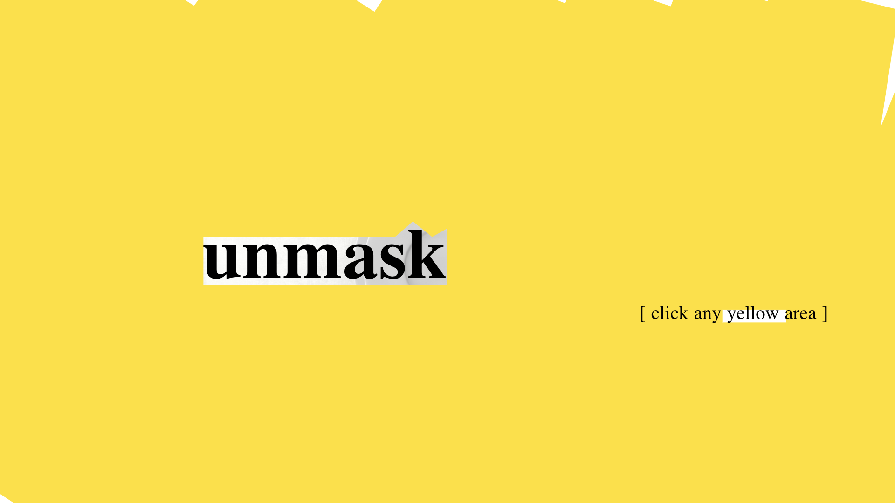

## Unmasking Masks  
### Uncovering global attitudes towards masks
##### Parsons School of Design MS Data Visualization Thesis '2020
###### Zui Chen
-------------
##### Masks have recently become common objects in our daily life and triggered world-wide arguments due to COVID-19.  There is a clear difference in attitudes between east Asian countries and the western world. How the difference derives and how the attitudes towards masks have changed globally become an interesting topic to explore.

Coronavirus has triggered a broad debate worldwide on masks. Through this project, I would like to discuss the global attitudes towards the mask and the rationale behind it.

The global attitudes towards the mask are different between western countries and East Asian.  One of the most impactful factors is laws and policies. The earliest anti-mask law dated back to 18  century in the United Kingdom and is called The Black Act.  About a century later, New York passed the first anti-mask law in the US. Since the late 20th century, 15 countries and regions have ever passed prohibitions against mask-wearing in public space. These laws all result from concerns about public safety because masks can easily disable individual identification. Also, all these anti-mask laws were in western countries except the one in Hong Kong last year.

During the 2002 SARS and 2009 H1N1 pandemic, there were only health organization recommendations on wearing masks for specific groups such as health care workers. While during the current Covid-19 epidemic, there have been 98 countries and regions requiring masks in public and 34 recommending masks. In East Asian countries, masks have been universally used. While most western countries just started to shift to a "pro-mask" attitude in such a pandemic time period in April.

Mask culture has spread over east Asian after SARS, mainly in Japan, China, and South Korea, and it becomes a norm for people to wear masks in public on a daily base. People also wear to stay away from dust or pollution, to keep warm, or as a social firewall to prevent interaction with strangers or a fashion statement. However, in the western world, the mask has still long been stigmatized and associated with diseases or danger. But recently, we can see that Covid-19 is bringing the two closer. 
